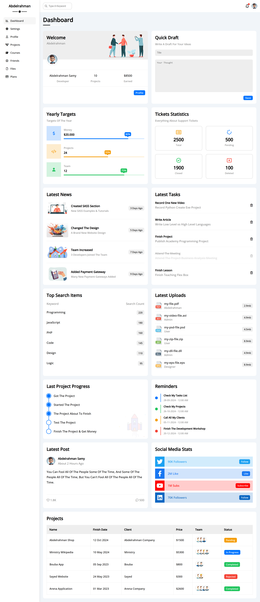

# 🚀 Modern Dashboard Panel

<div align="center">
  
  
  
  
</div>

<br>

<div align="center">
  <p><strong>A clean, modern, and fully responsive admin dashboard template built with pure HTML5 and CSS3</strong></p>
  <p>🎯 No JavaScript • 📱 Mobile-First • ⚡ Lightweight • 🎨 Modern UI</p>
</div>

---

## 📸 Preview



> **[🔗 Live Demo](https://abdelrahman-samy-dev.github.io/modern-panel/)** | **[📁 View Code](https://github.com/abdelrahman-samy-dev/modern-panel)**

---

## ✨ Features

### 🎨 **Design & UI**
- ✅ **Modern & Clean Interface** - Contemporary design following latest UI/UX trends
- ✅ **Fully Responsive Layout** - Seamless experience across desktop, tablet, and mobile
- ✅ **Dark/Light Theme Ready** - Easy to customize color schemes
- ✅ **Professional Typography** - Google Fonts integration (Cairo/Open Sans)
- ✅ **Consistent Spacing** - Well-structured layout with proper spacing system

### 🛠️ **Technical Features**
- ✅ **Pure HTML5 & CSS3** - No JavaScript dependencies
- ✅ **Semantic HTML Structure** - Accessible and SEO-friendly markup
- ✅ **CSS Grid & Flexbox** - Modern layout techniques
- ✅ **Media Queries** - Responsive breakpoints for all devices
- ✅ **Font Awesome Icons** - Professional iconography
- ✅ **Fast Loading** - Optimized and lightweight codebase

### 📱 **Layout Components**
- ✅ **Fixed Sidebar Navigation** - Collapsible menu with active states
- ✅ **Top Header Bar** - Search functionality and user profile section
- ✅ **Statistics Cards** - Data visualization blocks
- ✅ **Content Sections** - Organized dashboard widgets
- ✅ **Notification System** - Alert and notification indicators

---

## 🏗️ Project Structure

```
modern-panel/
│
├── 📄 index.html              # Main HTML file
├── 📁 css/
│   └── 🎨 framework.css           # Main stylesheet
├── 📁 imgs/
│   ├── 🖼️ screenshot.png      # Project preview image
├── 📄 README.md               # Project documentation
```

---

## 🚀 Quick Start

### 1️⃣ **Clone the Repository**
```bash
git clone https://github.com/abdelrahman-samy-dev/modern-panel.git
cd modern-panel
```

### 2️⃣ **Open in Browser**
```bash
# Simply open index.html in your preferred browser
open index.html
# Or for Windows
start index.html
```

### 3️⃣ **Start Customizing**
- Edit `css/style.css` to customize colors, fonts, and layout
- Modify `index.html` to add your content and sections
- Replace placeholder content with your actual data

---

## 🎯 Use Cases

### 💼 **Perfect For:**
- **Admin Dashboard Templates** - Ready-to-use backend interfaces
- **Portfolio Projects** - Showcase your frontend skills
- **Client Presentations** - Professional dashboard mockups
- **Learning Projects** - Study modern CSS techniques
- **Startup MVPs** - Quick dashboard prototypes

### 🎨 **Customization Ideas:**
- E-commerce Admin Panel
- Analytics Dashboard
- Project Management Interface
- CRM System Frontend
- Social Media Dashboard

---

## 🛠️ Built With

<table>
<tr>
<td align="center">

<br><strong>HTML5</strong>
</td>
<td align="center">

<br><strong>CSS3</strong>
</td>
<td align="center">

<br><strong>Font Awesome</strong>
</td>
<td align="center">

<br><strong>Google Fonts</strong>
</td>
</tr>
</table>

---

## 📱 Responsive Breakpoints

| Device | Screen Size | Layout |
|--------|-------------|---------|
| 📱 **Mobile** | < 768px | Stacked layout, collapsible sidebar |
| 📱 **Tablet** | 768px - 1024px | Compact sidebar, responsive grid |
| 💻 **Desktop** | > 1024px | Full sidebar, multi-column layout |

---

## 🎨 Color Palette

```css
/* Primary Colors */
--primary-color: #2563eb;
--secondary-color: #64748b;
--accent-color: #f59e0b;

/* Background Colors */
--bg-primary: #ffffff;
--bg-secondary: #f8fafc;
--bg-dark: #1e293b;

/* Text Colors */
--text-primary: #1e293b;
--text-secondary: #64748b;
--text-light: #94a3b8;
```

---

## 🔧 Customization Guide

### **Changing Colors:**
```css
/* Update CSS variables in style.css */
:root {
  --primary-color: #your-color;
  --secondary-color: #your-color;
}
```

### **Adding New Sections:**
```html
<!-- Add new dashboard cards -->
<div class="dashboard-card">
  <h3>Your Title</h3>
  <p>Your content here</p>
</div>
```

### **Modifying Layout:**
```css
/* Adjust grid layout */
.dashboard-grid {
  grid-template-columns: repeat(auto-fit, minmax(300px, 1fr));
}
```

---

## 🤝 Contributing

Contributions are welcome! Please feel free to submit a Pull Request.

### **How to Contribute:**
1. 🍴 Fork the repository
2. 🌿 Create your feature branch (`git checkout -b feature/AmazingFeature`)
3. ✅ Commit your changes (`git commit -m 'Add some AmazingFeature'`)
4. 📤 Push to the branch (`git push origin feature/AmazingFeature`)
5. 🔄 Open a Pull Request

---

## 📄 License

This project is licensed under the **MIT License** - see the [LICENSE](LICENSE) file for details.

---

## 👨‍💻 Author

<div align="center">
  
  <br>
  <strong>Abdelrahman Samy</strong>
  <br>
  <em>Frontend Developer</em>
  <br><br>
  
  [](https://github.com/abdelrahman-samy-dev)
  [](https://www.linkedin.com/in/abdelrahman-samy-ali/)
</div>

---

## 🌟 Show Your Support

If you found this project helpful, please consider giving it a ⭐ on GitHub!

<div align="center">
  <a href="https://github.com/abdelrahman-samy-dev/modern-panel">
    
  </a>
</div>

---

<div align="center">
  <p>Made with ❤️ by <a href="https://github.com/abdelrahman-samy-dev">Abdelrahman Samy</a></p>
  <p><em>Clean Code • Modern Design • Responsive Layout</em></p>
</div>